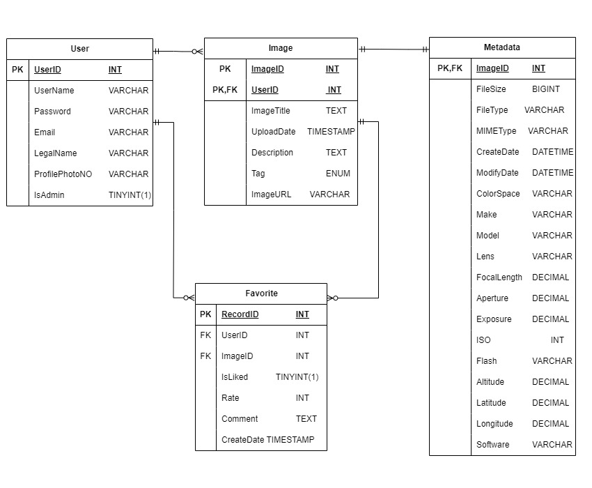

User DB:
-	UserID: A unique identifier for each user, automatically generated.
-	UserName: A preferred name the user gives (default is the user’s legal name).
-	Password: A hashed version of the user’s password.
-	Email: The user’s email address, unique for each user.
-	LegalName: The user’s legal name. 
-	ProfilePhotoNO: The NO of the image the user chooses in a set of images to be their avatar.
-	IsAdmin: Whether the user is an administrator.

Image DB:
-	ImageID: A unique identifier for each photo, automatically generated.
-	UserID: The UserID of the user who uploaded the image. 
-	ImageTitle: User-provided title of the image, can be edited by image uploader.
-	UploadDate: The timestamp for the image uploaded by the user. 
-	Description: User-provided description of the image, can be edited by image uploader.
-	Tag: The image’s tag, not editable by the image uploader. 
-	ImageURL: The URL to the uploaded image stored in Firebase.

Favorite DB:
-	RecordID: A unique identifier for each record, automatically generated.
-	UserID: The UserID of the user who like/comment/rate the image. 
-	ImageID: The ImageID of the image user likes/comments/rates. 
-	IsLiked: Whether the user likes the image.
-	Rate: The rate of the image given by the user. 
-	Comment: The comment on the image given by the user. 
-	CreatedDate: The timestamp for the record.

Metadata DB:
-	ImageID: The ImageID of the image to which the metadata belongs.
-	FileSize: The size of the image file in bytes.
-	FileType: The image file type (file’s extension).
-	MIMEType: “Multipurpose Internet Mail Extensions” type. 
-	CreateDate: The date and time when the file was originally created. 
-	ModifyDate: The date and time when the file was last modified.
-	ColorSpace: The range and type of colours that are represented in the image. 
-	Make: The camera manufacturer or device that captured or created the image.
-	Model: The particular model of the camera or device.
-	Lens: The lens used to capture the image.
-	FocalLength: The distance between the camera’s sensor and the lens when the image was taken. 
-	Aperture: The size of the lens opening when the picture was taken. 
-	Exposure: The amount of light that reaches the camera’s sensor. 
-	ISO: The camera sensor’s sensitivity to light. 
-	Flash: Whether the camera’s flash was used when the image was taken. 
-	Altitude: The height or elevation at which the image was taken. 
-	Latitude: The geographic coordinates of the image’s location. 
-	Longitude: The geographic coordinates of the image’s location.
-	Software: The software used to process or edit the image file.

Notes: 
1.	FileType & MIMEType: Some formats are more commonly associated with image manipulation software. i.e., the `.psd` file type directly points to Adobe Photoshop.
2.	CreateDate & ModifyDate: The image might have been edited if there is a significant gap between creation and modification dates. 
3.	ColorSpace: Some image manipulation tools can change an image’s colour space during editing. 
4.	Make & Model: The image might have been artificially generated or manipulated if the make and model do not align with known camera devices (e.g., an unfamiliar or nonsensical name).
5.	Software: If software like “Adobe Photoshop” is listed, the image was edited in Photoshop. Some AICG tools or platforms might also leave their software signature in the metadata.
